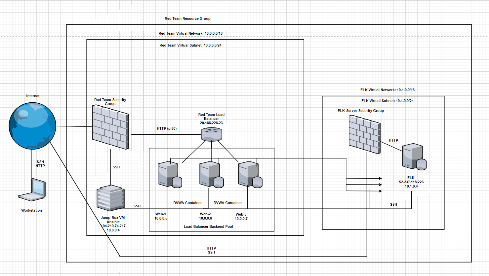
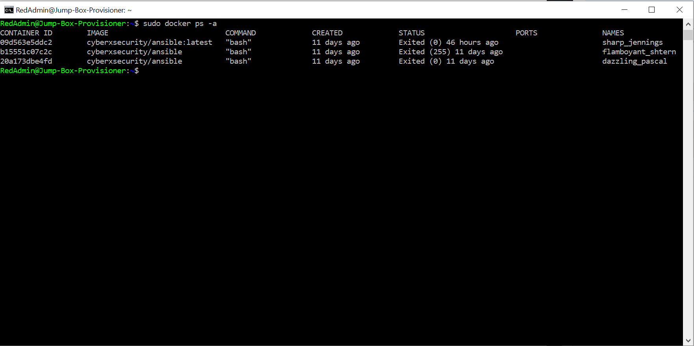

## Automated ELK Stack Deployment

The files in this repository were used to configure the network depicted below.

These files have been tested and used to generate a live ELK deployment on Azure. They can be used to either recreate the entire deployment pictured above. Alternatively, select portions of the Playbook file may be used to install only certain pieces of it, such as Filebeat.

  - Playbook files
 https://github.com/Christos1122/elk-project/find/main 

This document contains the following details:
- Description of the Topology
- Access Policies
- ELK Configuration
  - Beats in Use
  - Machines Being Monitored
- How to Use the Ansible Build

### Description of the Topology

The main purpose of this network is to expose a load-balanced and monitored instance of DVWA, the D*mn Vulnerable Web Application.

Load balancing ensures that the application will be highly efficient, in addition to restricting traffic to the network.
- Load balancers protects systems from network attacks such as DDOS, allowing the strain on a network to be distributed over multiple machines. 
- A jump-box aids in this protection as it provides a protective layer for the network as it acts as a gateway preventing unwanted traffic through and makes successful cyber-attacks on the server much more difficult. 

Integrating an ELK server allows users to easily monitor the vulnerable VMs for changes to the logs and system traffic.
- Filebeat: Watches for log data abotu the file system/machine.
- Metricbeat: Records a machines metrics.

The configuration details of each machine may be found below.

| Name      | Function                      | IP Address | Operating System |
|-----------|-------------------------------|------------|------------------|
| Jump Box  | Gateway                       | 10.0.0.4   | Linux            |
| Web-1     | Load-balanced web server      | 10.0.0.5   | Linux            |
| Web-2     | Load-balanced web server      | 10.0.0.6   | Linux            |
| ELK-SERVER| Receive logs from web servers | 10.1.0.4   | Linux            |

### Access Policies

The machines on the internal network are not exposed to the public Internet. 

Only the Jump-Box Provisioner machine can accept connections from the Internet. Access to this machine is only allowed from the following IP addresses:
- 101.186.35.71

Machines within the network can only be accessed by SSH through the use of containers.
- Only the Jump-Box Provisioner can access the ELK Virtual Machine.
- 52.237.118.226 (ELK Server IP). 

A summary of the access policies in place can be found in the table below.

| Name     | Publicly Accessible | Allowed IP Addresses | 
|--------------------------------|----------------------|
| Jump Box     | Yes             | 101.186.35.71        |
| Web-1, Web-2 | NO              | 104.210.74.217       |
| ELK-SERVER   | NO              | 104.210.74.217       |

### Elk Configuration

Ansible was used to automate configuration of the ELK machine. No configuration was performed manually, which is advantageous because it allows admis to focus their efforts on other more important tasks ansible automates a lot of tasks. 

The playbook implements the following tasks:
- Edit “hosts” file to include subheadings and IP addresses of the machines that docker/containers and ELK will be installed on. 
- Run “ansible-playbook ~/etc/ansible/roles/Install_docker&containers”.
- Run command “ansible-playbook ~/etc/ansible/roles/Elk-install”.

The following screenshot displays the result of running `docker ps` after successfully configuring the ELK instance.

### Target Machines & Beats
This ELK server is configured to monitor the following machines:
- Web-1: Public IP=20.188.228.23, Private IP=10.0.0.5
- Web-2: Public IP=20.188.228.23, Private IP=10.0.0.6
- Web-3: Public IP=20.188.228.23, Private IP=10.0.0.7

We have installed the following Beats on these machines:
- Filebeat
- Metricbeat

These Beats allow us to collect the following information from each machine:
- FIlebeat: Helps generate and organize log files to send to Logstach and Elasticsearch, example being system logs. 
- Metricbeat: Records a machines metrics. Simply put, it is a measurement about an aspect of a system that tells analysts how “healthy” it is, example being CPU usage. 

### Using the Playbook
In order to use the playbook, you will need to have an Ansible control node already configured. Assuming you have such a control node provisioned: 

SSH into the control node and follow the steps below:
- Copy the ansible config file to ~/etc/ansible.
- Update the hosts file to include:

[webservers]

-10.0.0.5 ansible_python_interpreter=/usr/bin/python3

-10.0.0.6 ansible_python_interpreter=/usr/bin/python3

-10.0.0.7 ansible_python_interpreter=/usr/bin/python3

[elk]

-10.1.0.4 ansible_python_interpreter=/usr/bin/python3

- Run the playbook, and navigate to ____ to check that the installation worked as expected.

- The ansible.cfg file is the playbook, which is copied from ........
- Do update and run the playbook on a specific machine and then specify which machine to install beats on, you edit the “hosts” file with a subheading and IP address and a file path. Eg. 
[webservers]
10.0.0.5 ansible_python_interpreter=/usr/bin/python3
You then add the subheading (webservers) inside the install file under subheading “hosts”, this will install the following file (elk) onto the IP addresses found in the hosts file. 

- To check if the ELK server is running, access http://52.237.118.226:5601/app/kibana 

Commands for user to update and install everything correctly for use.
1.	Download the playbook in its entirety. 
2.	Move files to ~/etc/ansible (create directory if not there)
3.	Move files to roles and hosts****
4.	Edit hosts file to contain the IP address (as shown above) of the machines they want to have the playbook run on. -Also note machine IPs must be under subheadings that will correspond with install files to ensure correct files get installed on correct machines.
5.	Edit install files (Docker, ELK & Filebeat) to ensure hosts and remote user are correct in relation to “hosts” file subheadings and user account. 
6.	Run command “ansible-playbook ~/etc/ansible/roles/Install_docker&containers”.
7.	Run command “ansible- playbook ~/etc/ansible/roles/Elk-install”.
8.	Run command “ansible- playbook ~/etc/ansible/roles/Filebeat-install”.
9.	Now all files have been updates and installed correctly on the machines provided.
10.	To view containers “sudo docker ps -a” 
11.	To start container “sudo docker start ‘container name’” & “sudo docker attach ‘container name’”. 
